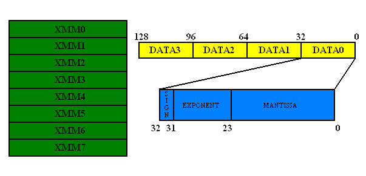
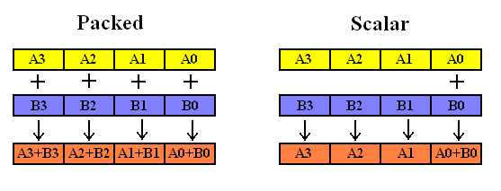
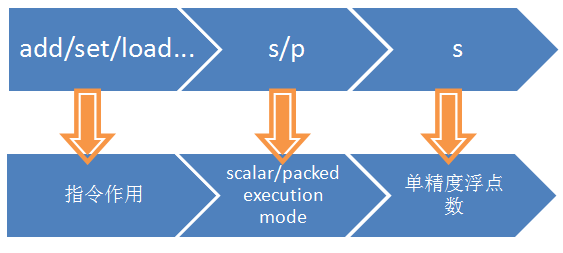

#SIMD
SIMD(Single instruction, multiple data (SIMD))

一般通过嵌入汇编来使用这些指令，即Compiler Instrinsics。Intrinsics是对MMX、SSE等指令集的指令的一种封装，以函数的形式提供，使得程序员更容易编写和使用这些高级指令，在编译的时候，这些函数会被内联为汇编，不会产生函数调用的开销。
##Histroy
1.	第一代MMX,3DNow! ``__m64``,不支持x64
2.	第二代SSE,SSE2,SSX, ``__128``,
3.	第三代AVX指令集

**相关手册见paper**
##SSE指令集
###指令集组成
SSE指令包括了四个主要的部份：单精确度浮点数运算指令、整数运算指令（此为MMX之延伸，并和MMX使用同样的暂存器）、Cache控制指令、和状态控制指令。
###SSE新增的寄存器（用于浮点运算指令）
SSE新增了八 ​​个新的128位元暂存器，xmm0 ~ xmm7。这些128位元的暂存器，可以用来存放四个32位元的单精确度浮点数。SSE的浮点数运算指令就是使用这些暂存器。
下图是SSE新增寄存器的结构：

###SSE浮点运算指令分类
SSE的浮点运算指令分为两大类：packed和scalar

Packed指令是一次对XMM暂存器中的四个浮点数（即DATA0 ~ DATA3）均进行计算，而scalar则只对XMM暂存器中的DATA0进行计算。如下图所示：

###SSE指令一般格式
由三部分组成，第一部分是表示指令的作用，比如加法add等，第二部分是s或者p分别表示scalar或packed，第三部分为s，表示单精度浮点数（single precision floating point data）,d表示双精度，如下图：

###SSE新的数据类型
根据上面知道，SSE新增的寄存器是128bit的，那么SSE就需要使用128bit的数据类型，SSE使用4个浮点数（4*32bit）组合成一个新的数据类型，用于表示128bit类型，SSE指令的返回结果也是128bit的。
1.	__m128
2.	__m128i
3.	__m128d

###SSE定址/寻址方式
SSE 指令和一般的x86 指令很类似，基本上包括两种定址方式：寄存器-寄存器方式(reg-reg)和寄存器-内存方式(reg-mem)：

		addps xmm0, xmm1 ; reg-reg
		addps xmm0, [ebx] ; reg-mem

###SSE指令的内存对齐要求
SSE中大部分指令要求地址是16bytes对齐的，要理解这个问题，以_mm_load_ps函数来解释，这个函数对应于loadps的SSE指令。其原型为：``extern __m128 _mm_load_ps(float const*_A)``,可以看到，它的输入是一个指向float的指针，返回的就是一个``__m128``类型的数据，从函数的角度理解，就是把一个float数组的四个元素依次读取，返回一个组合的``__m128``类型的SSE数据类型，从而可以使用这个返回的结果传递给其它的SSE指令进行运算，比如加法等；从汇编的角度理解，它对应的就是读取内存中连续四个地址的float数据，将其放入SSE新的暂存器(xmm0~8)中，从而给其他的指令准备好数据进行计算。其使用示例如下：

	float input[4] = { 1.0f, 2.0f, 3.0f, 4.0f };  
	__m128 a = _mm_load_ps(input);  

这里加载正确的前提是：input这个浮点数阵列都是**对齐在16 bytes**的边上。否则加载的结果和预期的不一样。如果**没有对齐**，就需要使用``_mm_loadu_ps``函数，这个函数用于处理没有对齐在16bytes上的数据，但是其速度会比较慢。关于内存对齐的问题，这里就不详细讨论什么是内存对齐了，以及如何指定内存对齐方式。这里主要提一下，SSE的intrinsics函数中的扩展的方式：
对于上面的例子，如果要将input指定为16bytes对齐，可以采用的方式是：

		__declspec(align(16)) float input[4];
		那么，为了简化，在xmmintrin.h中定义了一个宏_MM_ALIGN16来表示上面的含义，即：_MM_ALIGN16 float input[4];

###大小端问题
x86的little-endian特性，位址较低的byte会放在暂存器的右边。也就是说，若以上面的input为例，在载入到XMM暂存器后，暂存器中的DATA0会是1.0，而DATA1是2.0，DATA2是3.0，DATA3是4.0。如果需要以相反的顺序载入的话，可以用_mm_loadr_ps 这个intrinsic，根据需要进行选择。

##[指令集操作](https://software.intel.com/sites/landingpage/IntrinsicsGuide/)[msdn](https://msdn.microsoft.com/zh-cn/library/hh977022.aspx)
### Load/Store/Set 
####Load
从内存到寄存器

	__m128 _mm_load_ss (float *p)  //scalar加载 
	__m128 _mm_load_ps (float *p)  // vector加载，16bit内存对齐
	__m128 _mm_loadu_ps (float *p) // vector加载，没必要对齐

####Set

	__m128 _mm_set_ss (float w)  
	__m128 _mm_set_ps (float w, float z, float y, float x)
	__m128 _mm_setr_ps (float x, float y, float z, float w) //不带r的是从高位开始填，是反着的，带r的符合正常习惯 
	__m128 _mm_setzero_ps ()                                //清零
	__m128i _mm_setr_epi32 (int e3, int e2, int e1, int e0) //设整数

####Store
从寄存器到内存

	void _mm_store_ss (float *p, __m128 a)  
	void _mm_store_ps (float *p, __m128 a)  

####加法
	
	__m128 _mm_add_ss (__m128 a, __m128 b)  
	__m128 _mm_add_ps (__m128 a, __m128 b)  
####减法
	__m128 _mm_sub_ps (__m128 a, __m128 b)

####shuffle
	__m128 _mm_shuffle_ps (__m128 a, __m128 b, unsigned int imm8)
	{
		SELECT4(src, control){ //下面会调用，就是根据control（2bit,4种值，对应__m128的每个float)
			CASE(control[1:0])
			0:	tmp[31:0] := src[31:0]
			1:	tmp[31:0] := src[63:32]
			2:	tmp[31:0] := src[95:64]
			3:	tmp[31:0] := src[127:96]
			ESAC
			RETURN tmp[31:0]
		}
		
		dst[31:0] := SELECT4(a[127:0], imm8[1:0]) 
		dst[63:32] := SELECT4(a[127:0], imm8[3:2])
		dst[95:64] := SELECT4(b[127:0], imm8[5:4])
		dst[127:96] := SELECT4(b[127:0], imm8[7:6])
	}
	用于快速的将vector的值全赋为其某一元素，见VectorReplicate
#### and
	__m128 _mm_and_ps (__m128 a, __m128 b)

##DirectXMath
[Introducing DirectXMath](https://blogs.msdn.microsoft.com/chuckw/2012/03/26/introducing-directxmath/) 主要介绍了DirectXMath数学库不再依赖<windows.h>头文件。

[DirectXMath注意事项](https://msdn.microsoft.com/en-us/library/windows/desktop/ee418732(v=vs.85).aspx#Properly_Align_Alloc) 介绍了

1.	SSE指令对内存16bit对齐的速度较快，x64和x86在栈上的变量和和全局变量都是16位对齐的内存分配，但malloc时，对x64来说是16位对齐的，x86来说是8位对齐的，故对于x86使用SSE时，要注意分配器的16位对齐。[内存对齐的stl内存分配器](https://blogs.msdn.microsoft.com/vcblog/2008/08/28/the-mallocator/)
2.	For Windows x86 targets, enable /arch:SSE2. For all Windows targets, enable /fp:fast.